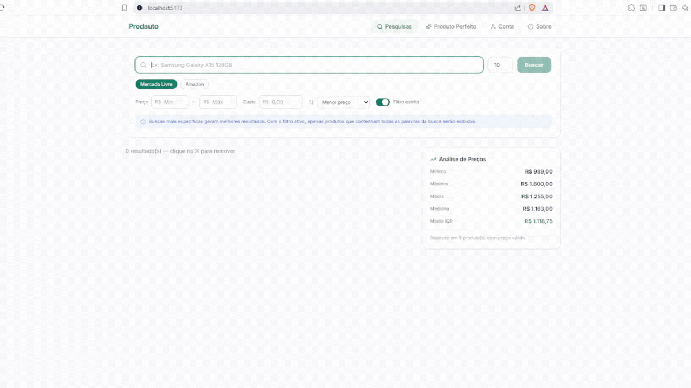
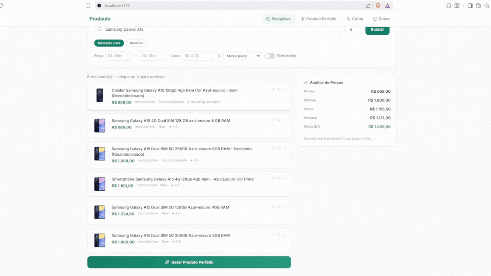
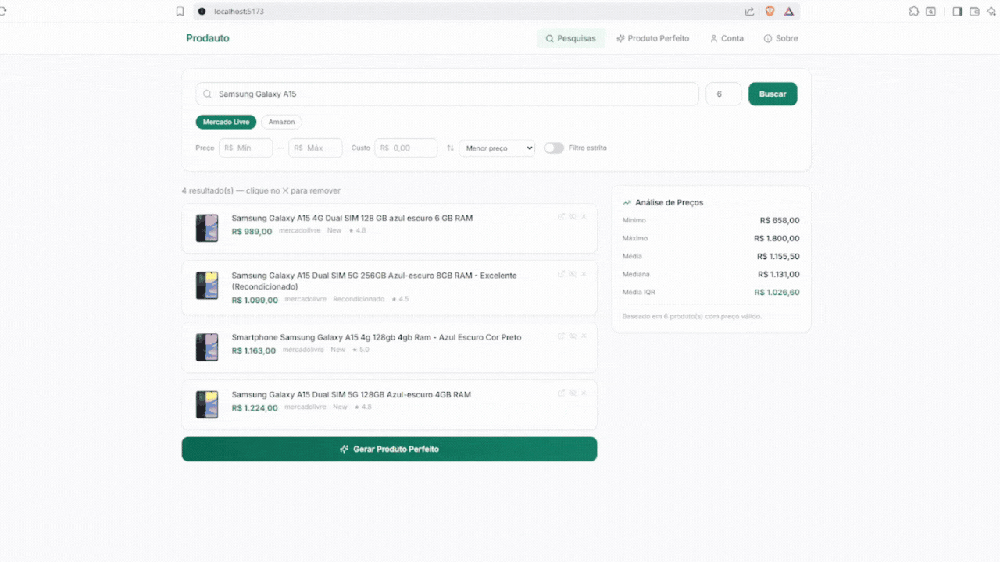
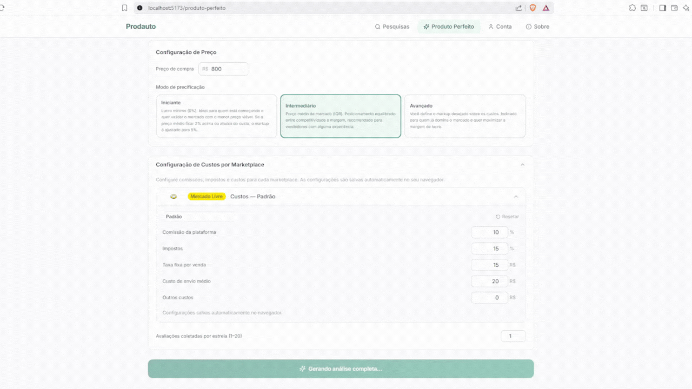

# Prodauto — Análise de Produtos e Preços para Marketplaces Brasileiros

Testar produtos é uma tarefa trabalhosa, especialmente comparar preços com os concorrentes, verificar viabilidade e criar uma oferta que gere vendas. É exatamente esse problema que o Prodauto busca resolver.

O usuário faz uma pesquisa no site, que realiza scraping em marketplaces (Mercado Livre e Amazon, até o momento), coleta os produtos, calcula métricas de precificação e viabilidade (preço de aquisição + taxas + impostos + outros custos), analisa descrições e avaliações de clientes e gera uma versão aprimorada do produto com IA.

> **Disclaimer**
> O site está em protótipo: é mais um projeto de portfólio do que algo para produção e geração de renda. Dependendo de uma eventual demanda concreta, poderia se tornar. Por esse motivo, este documento mostra a estrutura e o raciocínio por trás do projeto, não o código em si.

---

## Índice

1. [Demonstração](#demonstração)
2. [Funcionalidades](#funcionalidades)
3. [Arquitetura do Sistema](#arquitetura-do-sistema)
4. [Ferramentas Utilizadas](#ferramentas-utilizadas)
5. [Estrutura de Arquivos](#estrutura-de-arquivos)
6. [Instalação e Configuração](#instalação-e-configuração)
7. [Como Executar](#como-executar)
8. [Como Funciona — Fluxo Completo](#como-funciona--fluxo-completo)
9. [Motor de Análise de Preços](#motor-de-análise-de-preços)
10. [Como o Projeto foi Construído](#como-o-projeto-foi-construído)
11. [Deploy](#deploy)
12. [Próximos Passos](#próximos-passos)
13. [Licença](#licença)

---

## Demonstração

### Página de Busca


### Removendo Itens


### Configurando a Página de Produto


### Gerando o Produto Perfeito


---

## Funcionalidades

### Página de Pesquisa
- Busca em múltiplos marketplaces simultaneamente.
- **Filtro estrito:** a busca continua recursivamente até encontrar a quantidade solicitada de produtos que contenham **todas** as palavras da query.
- Remoção individual de produtos com o botão ✕.
- Preço de compra configurável (usado na análise de viabilidade).
- Análise de preços em tempo real: mínimo, máximo, média, mediana e média IQR.
- Cards de produto com título, link, avaliação, preço, condição, entrega, descrição e imagem.

### Produto Perfeito
- Análise separada por marketplace, com logos oficiais.
- Visão geral consolidada de todos os marketplaces.
- **Configuração de custos** por marketplace (comissão, impostos, taxa fixa, frete, outros), salva automaticamente no navegador.
- Indicador de viabilidade (verde/vermelho) baseado no preço de compra.
- Margem líquida estimada após todos os custos.
- Preço mínimo viável calculado automaticamente.
- **Descrição profissional** gerada por IA a partir das 5 primeiras descrições coletadas.
- **Avaliações por estrela** (1★ a 5★) coletadas automaticamente do Mercado Livre.
- **Sugestões de melhoria** geradas por IA com base nas avaliações reais.
- **Geração de imagem** 720×720 sob demanda, com botão de download.

### Motor de Preços (visualização de margens)
- Filtro IQR para remoção de outliers antes de calcular a média.
- Piso competitivo (preço abaixo dos 20% mais baratos do mercado).
- Cálculo do preço mínimo viável considerando todos os custos em comparação com os concorrentes.

---

## Arquitetura do Sistema

O Prodauto é dividido em três processos independentes que se comunicam via HTTP:

```
Navegador (React) → FastAPI (porta 8000) → Servidor de Scraping (porta 8001)
```

Essa separação existe por dois motivos: o Playwright não consegue compartilhar o event loop assíncrono com o FastAPI no Windows (rodando em processos separados, cada um tem seu próprio loop) e, se o scraping falhar, o backend não quebra junto.

```
┌─────────────────────────────────────────────────────┐
│  Navegador — React + Vite (porta 5173)              │
│  SearchPage · PerfectProductPage · AccountPage      │
└───────────────────┬─────────────────────────────────┘
                    │ HTTP (proxy Vite em dev)
                    ▼
┌─────────────────────────────────────────────────────┐
│  Backend — FastAPI (porta 8000)                     │
│  /api/v1/search/                                    │
│  /api/v1/produto-perfeito/                          │
│  /api/v1/produto-perfeito/gerar-imagem              │
└───────────────────┬─────────────────────────────────┘
                    │ HTTP interno (porta 8001)
                    ▼
┌─────────────────────────────────────────────────────┐
│  Servidor de Scraping — FastAPI (porta 8001)        │
│  /scrape          → coleta produtos                 │
│  /scrape-reviews  → coleta avaliações por estrela   │
└───────────────────┬─────────────────────────────────┘
                    │ subprocess + Playwright CDP
                    ▼
┌─────────────────────────────────────────────────────┐
│  Chrome (modo debug remoto, porta 9222)             │
│  Lançado automaticamente pelo scraper               │
└─────────────────────────────────────────────────────┘
```

---

## Ferramentas Utilizadas

| Ferramenta | Categoria / Camada | Descrição do Uso no Projeto |
| :--- | :--- | :--- |
| **React** | Frontend | Interface de usuário dinâmica e interativa. |
| **Zustand** | Frontend | Estado global da busca e dos custos por marketplace. |
| **FastAPI** | Backend | Rotas da API, precificação e integração de serviços. |
| **Uvicorn** | Servidor local | Servidor ASGI usado para rodar o backend em desenvolvimento. |
| **Playwright, Selenium & BeautifulSoup** | Scraping | **Playwright:** automação assíncrona; <br>**Selenium:** bypass anti-bot e resoluções complexas; <br>**BeautifulSoup:** extração rápida de dados do HTML. |
| **Gemini (Flash 2.5)** | Inteligência Artificial | Geração do "Produto Perfeito" (descrições, análise de avaliações, insights) e apoio na resolução de dúvidas de código. |
| **Claude** | Engenharia auxiliar | Concepção, design e geração da estrutura inicial de arquivos e diretórios. |
| **Ngrok** | Conectividade | Túnel seguro para expor o backend local (localhost) para a internet. |
| **Vercel** | Hospedagem | Hospedagem pública do frontend em React. |

---

## Estrutura de Arquivos

```
Product_Pricing_Project/
│
├── src/
│   └── scraper.py                  ← Lógica de scraping (Playwright + BeautifulSoup)
│
├── scraper_server.py               ← Servidor de scraping independente (porta 8001)
│
├── backend/
│   ├── app/
│   │   ├── main.py                 ← Entry point do FastAPI
│   │   │
│   │   ├── api/routes/
│   │   │   ├── search.py           ← POST /search/ (busca + filtro recursivo)
│   │   │   ├── perfect_product.py  ← POST /produto-perfeito/ e /gerar-imagem
│   │   │   └── auth.py             ← Rotas de autenticação (preparadas, não ativas)
│   │   │
│   │   ├── core/
│   │   │   ├── config.py           ← Lê variáveis do .env via pydantic-settings
│   │   │   ├── security.py         ← JWT, hash de senha (preparado para auth)
│   │   │   └── constants.py        ← Configurações globais (limites, chave de IA)
│   │   │
│   │   ├── db/
│   │   │   └── session.py          ← Engine async do SQLAlchemy (para quando o DB for ativado)
│   │   │
│   │   ├── models/
│   │   │   └── models.py           ← Tabelas: User, Search, Result, PriceSnapshot
│   │   │
│   │   ├── schemas/
│   │   │   └── schemas.py          ← Validação Pydantic de request/response
│   │   │
│   │   └── services/
│   │       ├── analytics.py        ← Motor de preços (IQR, viabilidade, custos)
│   │       ├── scraper_bridge.py   ← Chama o servidor de scraping via HTTP
│   │       ├── review_scraper.py   ← Chama /scrape-reviews no servidor
│   │       └── ai_service.py       ← Integração com IA (descrição, melhorias, imagem)
│   │
│   ├── alembic/                    ← Migrações de banco de dados
│   ├── tests/
│   │   └── test_analytics.py       ← Testes unitários do motor de preços
│   ├── requirements.txt
│   ├── Dockerfile
│   └── alembic.ini
│
├── frontend/
│   ├── src/
│   │   ├── App.tsx                 ← Roteamento das páginas
│   │   ├── main.tsx                ← Entry point React
│   │   │
│   │   ├── pages/
│   │   │   ├── SearchPage.tsx         ← Página principal de busca
│   │   │   ├── PerfectProductPage.tsx ← Análise completa do produto
│   │   │   └── AccountPage.tsx        ← Placeholder para conta/login
│   │   │
│   │   ├── components/
│   │   │   ├── layout/
│   │   │   │   └── AppLayout.tsx        ← Header (desktop) + nav inferior (mobile)
│   │   │   └── ui/
│   │   │       ├── MarketplaceBadge.tsx ← Logo do marketplace com fallback
│   │   │       └── CostsPanel.tsx       ← Painel colapsável de custos por marketplace
│   │   │
│   │   ├── store/
│   │   │   ├── searchStore.ts      ← Estado global da busca (Zustand)
│   │   │   └── costsStore.ts       ← Custos por marketplace (persiste no localStorage)
│   │   │
│   │   └── lib/
│   │       ├── api.ts              ← Cliente Axios com injeção automática de JWT
│   │       └── types.ts            ← Interfaces TypeScript + dados dos marketplaces
│   │
│   ├── vite.config.ts
│   ├── tailwind.config.js
│   └── package.json
│
├── infra/
│   └── nginx.conf                  ← Config Nginx para produção
│
├── assets/                         ← GIFs de demonstração usados neste README
├── docker-compose.yml              ← Sobe tudo com Docker (para deploy)
├── .env.example                    ← Template de variáveis de ambiente
└── .gitignore
```

---

## Instalação e Configuração

### Pré-requisitos
- Python 3.12+
- Node.js 22+
- Google Chrome instalado em `C:\Program Files\Google\Chrome\Application\chrome.exe`
- Git

### 1. Clone o repositório

```bash
git clone <url-do-seu-repositorio>
cd Product_Pricing_Project
```

### 2. Configure o ambiente do backend

```bash
cd backend
python -m venv .venv

# Windows
.venv\Scripts\activate

# Mac/Linux
source .venv/bin/activate

pip install -r requirements.txt
```

### 3. Configure o arquivo `.env`

Copie o template e preencha:

```bash
cp .env.example .env
```

Conteúdo mínimo para rodar sem banco de dados:

```env
DATABASE_URL=not_configured
SECRET_KEY=not_configured
ENVIRONMENT=development
ALLOWED_ORIGINS=["http://localhost:5173"]
```

Para habilitar os recursos de IA (descrição, sugestões de melhoria e imagem), configure também a chave da API em `backend/app/core/constants.py`.

### 4. Configure o frontend

```bash
cd frontend
npm install
```

### 5. Ajuste o proxy do Vite para desenvolvimento local

Abra `frontend/vite.config.ts` e certifique-se de que o proxy aponta para:

```typescript
target: 'http://127.0.0.1:8000',
```

---

## Como Executar

Você precisa de **3 terminais** rodando simultaneamente.

### Terminal 1 — Servidor de Scraping

```bash
python scraper_server.py
```

Verifique em http://localhost:8001/health. Resposta esperada: `{"status":"ok","servico":"scraper"}`

### Terminal 2 — Backend FastAPI

```bash
cd backend
set PYTHONPATH=.                    # Windows
# export PYTHONPATH=.              # Mac/Linux

uvicorn app.main:app --reload --port 8000
```

Verifique em http://localhost:8000/health. Documentação da API: http://localhost:8000/docs

### Terminal 3 — Frontend React

```bash
cd frontend
npm run dev
```

Acesse http://localhost:5173

---

## Como Funciona — Fluxo Completo

### Busca de produtos

```
1. Usuário digita "Samsung Galaxy A15 128GB" e clica em Buscar
2. SearchPage.tsx → api.post('/search/') via Axios
3. Vite intercepta e redireciona para http://127.0.0.1:8000/api/v1/search/
4. FastAPI recebe em routes/search.py → run_search()
5. scraper_bridge.py faz POST http://localhost:8001/scrape
6. scraper_server.py importa o scraper.py e chama run_scraper()
7. scraper.py lança o Chrome via subprocess e conecta via Playwright CDP
8. O Chrome navega no marketplace e o BeautifulSoup extrai os dados
9. Resultados sobem: scraper → scraper_server → bridge → route
10. Se o filtro estrito está ativo, repete até ter produtos suficientes (máx. 5 tentativas)
11. analytics.py filtra outliers (IQR) e calcula todas as métricas
12. O JSON retorna ao frontend → Zustand (searchStore) guarda em memória
13. O React re-renderiza os cards de resultado
```

**Dados coletados por produto:**

| Campo | Descrição |
|---|---|
| `title` | Título do anúncio |
| `link` | URL do produto |
| `rating` | Avaliação |
| `price` | Preço |
| `condition` | Condição (padrão: "New") |
| `shipping` | Informação de entrega |
| `description` | Descrição (preenchida em etapa posterior) |
| `image` | URL da imagem principal |

### Produto Perfeito

```
1. Usuário clica em "Gerar Produto Perfeito"
2. PerfectProductPage lê os resultados do Zustand (sem nova busca)
3. Lê a configuração de custos do costsStore (localStorage)
4. POST /api/v1/produto-perfeito/ com resultados + custos + preço de compra
5. perfect_product.py agrupa por marketplace e calcula viabilidade
6. review_scraper.py pede ao scraper_server para coletar avaliações
7. O scraper_server abre o produto mais bem avaliado e navega pela página
8. Para cada estrela (5→1): abre o dropdown, filtra e coleta N comentários
9. ai_service.py chama a IA (se configurada) para descrição e melhorias
10. PerfectProductResponse retorna tudo consolidado
11. O frontend exibe cards por marketplace com indicadores visuais
```

### Geração de imagem (sob demanda)

```
1. Usuário clica em "Gerar imagem do produto"
2. POST /api/v1/produto-perfeito/gerar-imagem
3. ai_service.generate_image_prompt() chama a API de imagem
4. A URL da imagem retorna e é exibida com botão de download
```

---

## Motor de Análise de Preços

Localizado em `backend/app/services/analytics.py`.

### Métricas calculadas

| Métrica | Fórmula / Descrição |
|---|---|
| `min_price` | Menor preço entre todos os resultados |
| `max_price` | Maior preço |
| `mean_price` | Média simples (inclui outliers) |
| `median_price` | Valor do meio quando ordenados |
| `iqr_mean` | Média após remover outliers via filtro IQR (mais confiável) |
| `competitive_floor` | Preço 1% abaixo do percentil 20 dos menores preços |
| `suggested_price_*` | `iqr_mean × (1 + markup%)` para 10%, 20% e 30% |
| `minimum_viable_price` | Menor preço de venda em que o vendedor não tem prejuízo |
| `is_viable` | `true` se `iqr_mean >= minimum_viable_price` |

### Filtro IQR (remoção de outliers)

```
1. Ordena os preços
2. Calcula Q1 (25%) e Q3 (75%)
3. IQR = Q3 - Q1
4. Remove preços abaixo de Q1 - 1.5×IQR ou acima de Q3 + 1.5×IQR
5. Calcula a média dos preços restantes
```

Isso evita que listagens falsas (R$ 1,00) ou absurdamente caras distorçam a análise.

### Cálculo de viabilidade

```
Preço mínimo viável = (preço_compra + taxa_fixa + frete + outros)
                      ÷ (1 - comissão% - impostos%)

Se iqr_mean >= preço_mínimo_viável → VIÁVEL (verde)
Se iqr_mean <  preço_mínimo_viável → INVIÁVEL (vermelho)
```

### Nota metodológica das avaliações

> A análise é gerada com base nas avaliações reais de clientes, agrupadas por nota (1 a 5 estrelas). A IA identifica padrões de satisfação e insatisfação para sugerir melhorias objetivas.

---

## Como o Projeto foi Construído

### Ideia

A ideia surgiu da busca por um projeto prático em Python, dentro de temas como **Webscraping**, **Análise de Dados** ou **Redes Neurais**, assuntos de interesse que pretendo explorar em novos projetos. Pedi à IA algumas ideias, e uma delas foi o **Scraping de Produtos**, algo básico para quem gosta de scraping. Decidi fazer a minha versão, com um toque diferente.

Há alguns anos criei uma loja de Dropshipping, embarcando na tendência do momento, então tenho experiência com o assunto (design, tráfego, análise de produtos). Lembrava que o teste de produtos era uma das partes mais cansativas: entre vários produtos, era preciso:

1. fazer uma **pesquisa nos concorrentes** para ver como abordavam o produto;
2. encontrar um **fornecedor** com bons preços para verificar a viabilidade;
3. **criar uma oferta** interessante (a forma de abordar a venda);
4. fazer **tráfego pago** para validar a demanda.

A solução foi atacar ao menos parte do problema: fazer scraping nos concorrentes, verificar preços, descrição e oferta, e gerar algo aprimorado para tentar superá-los. Scraping no Google seria mais trabalhoso (possivelmente exigindo uma LLM para navegar de forma dinâmica), então o foco ficou nos marketplaces, que, apesar de mais simples, trouxeram seus próprios desafios, principalmente a detecção de bots.

### Passo 1 — Backend e Frontend

Como o scraping seria em Python, a forma mais direta de integrar tudo era um backend em Python com **FastAPI**. Streamlit e similares foram descartados: apesar de mais fáceis, não resultariam na estrutura de um site profissional. Entre os frameworks JavaScript (React, Vue e Angular), escolhi o **React**, por ser o mais popular atualmente.

### Passo 2 — Scraping

O scraper roda como uma janela automatizada do Chrome que acessa o site e coleta as informações pelo HTML. O problema é que a maioria dos grandes sites usa detecção de bots, o que inutiliza muitos scrapers, principalmente em modo headless (sem janela visível), que eu considero essencial para rodar em servidores sem interface gráfica.

Como o scraping é a alma do projeto, ele foi construído e testado primeiro. Entre as opções conhecidas (Selenium, BeautifulSoup e Playwright), a melhor solução acabou sendo usar as três juntas. Pode parecer uma engenhoca, mas foi o que tornou o scraping ágil e efetivo:

- **Playwright:** ótimo para páginas dinâmicas, rápido e com suporte a async, abrindo várias páginas de forma simples.
- **BeautifulSoup:** é apenas um parser de HTML, então não serve para páginas dinâmicas, mas é extremamente rápido.
- **Selenium:** é mais lento, porém tem um ótimo modo de anti-detecção de bots e, se necessário, resolução de captcha.

A combinação une a velocidade dinâmica do Playwright, a anti-detecção do Selenium e o parser do BeautifulSoup ao chegar na página de destino. Com isso, foi possível contornar a detecção no **Mercado Livre** e na **Amazon**. Já a **Magazine Luiza** bloqueou o acesso (somente em modo headless) e a **Shopee** exige login antes de entrar.

### Passo 3 — Estrutura inicial

A estrutura inicial do site foi gerada com o **Claude Code** (versão gratuita), a partir de requisitos básicos:

- Frontend em React, backend com Python + FastAPI.
- Barra de pesquisa na página principal.
- Conexão com o código de scraping via backend.
- Métricas de análise de preços: mínimo, máximo, média, mediana e média IQR.
- Cards de produto em lista com título, link, avaliações, preço, condição, entrega, descrição e imagem.

### Passo 4 — Testes e aprimoramento

Para o scraping funcionar de forma estável, foi necessário um servidor próprio para ele, de modo que erros no scraper não derrubem o backend. Nos testes, um servidor foi ligado para cada camada (frontend, backend e scraping), conforme descrito em [Como Executar](#como-executar).

### Passo 5 — Integração com IA

Para ligar uma API de IA gratuitamente, foi utilizada a API do Google (**Gemini Flash 2.5**). Um arquivo separado, `test_ai.py`, foi criado para testar a requisição. Deu algum trabalho chegar à chamada funcional, pois a documentação oficial parecia desatualizada: pedi ao próprio Gemini o nome do modelo correto, testei cerca de três e funcionou.

Esse modelo poderia até ser usado em uma versão real, como backup, mas exigiria atenção aos limites de tokens e **não deve ser usado com dados sensíveis**, já que o Google informa que dados públicos podem ser usados para treino.

---

## Deploy

Para tornar o site acessível a todos, seria necessário hospedar frontend, backend e scraper. Em uma estrutura gratuita, o frontend poderia ficar na **Vercel** e o backend no **Railway** ou **Render**. O scraper, porém, precisaria de uma **VPS** (paga).

Por isso, para testes, a configuração atual é:

- **Frontend:** Vercel.
- **Backend e scraper:** rodando na máquina local.
- **Conexão:** a Vercel lê a URL do **ngrok**, um tunelador que direciona com segurança as requisições do frontend para a máquina local.

Obviamente essa não é uma estrutura viável para produção, a menos que a máquina seja dedicada exclusivamente a isso, mas atende bem à fase de testes.

---

## Próximos Passos

- Corrigir a conexão entre a Vercel e o backend (problema em aberto).
- Criar a ligação com banco de dados e uma tela de login, com limite de uso por usuário para não esgotar os tokens do modelo rapidamente nem sobrecarregar o hardware com o scraping.
- Aprimorar o scraper da Amazon e adicionar outros marketplaces.
- Avaliar uma busca dinâmica com IA, que permitiria pesquisar em sites desconhecidos pelo próprio Google. O desafio seria o alto consumo de tokens por busca.

---

## Licença

Projeto feito por Vitor Costa. Todos os direitos reservados.
